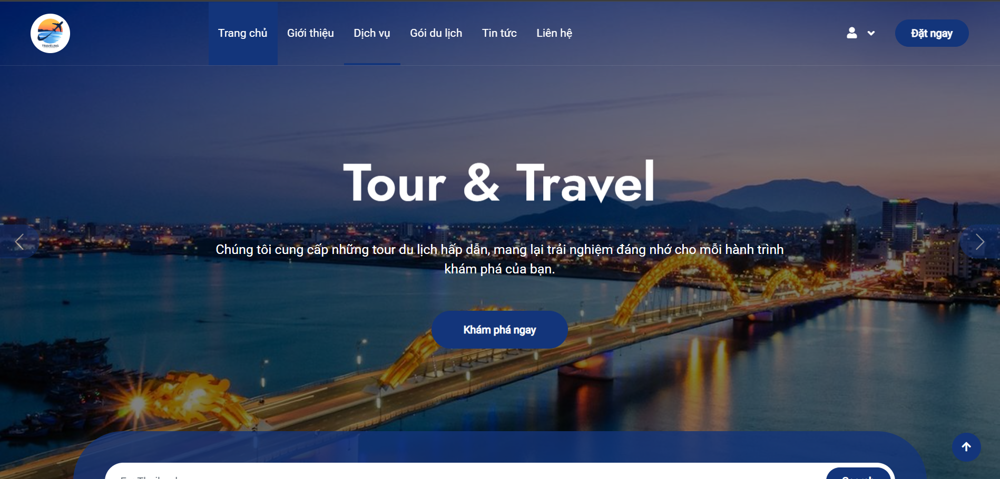
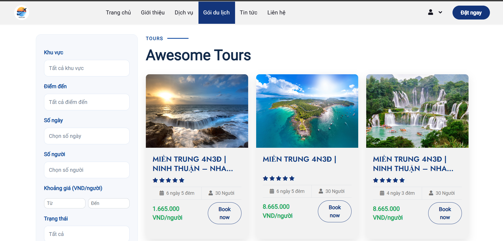
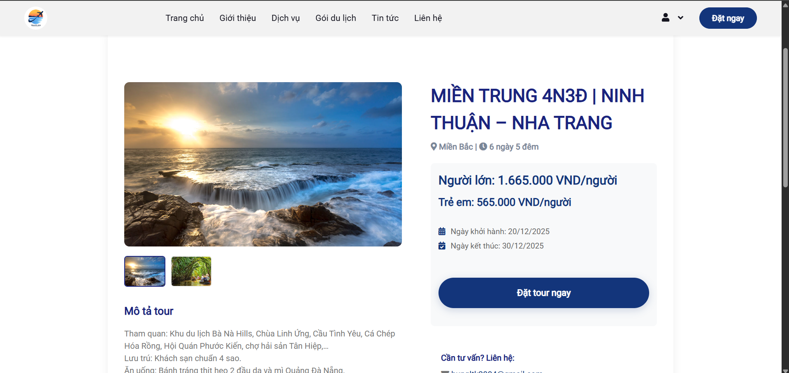

# 🌏 Travel Management System

<div align="center">


A comprehensive travel tour booking management system built on Laravel Framework

[Features](#-features) •
[Installation](#-installation) •
[Usage](#-usage) •
[Contributing](#-contributing)

</div>

---

## 📋 Table of Contents

- [Introduction](#-introduction)
- [Features](#-features)
- [Tech Stack](#-tech-stack)
- [System Requirements](#-system-requirements)
- [Installation](#-installation)
- [Project Structure](#-project-structure)
- [Usage](#-usage)
- [API Documentation](#-api-documentation)
- [Screenshots](#-screenshots)
- [Contributing](#-contributing)
- [License](#-license)
- [Contact](#-contact)

---

## 🎯 Introduction

**Travel Management System** is a modern web application for managing travel tours, developed using Laravel Framework. The system provides complete features for both customers and administrators, from searching and booking tours to managing orders and revenue statistics.

### 🎨 Key Highlights

- ✅ User-friendly, responsive interface on all devices
- ✅ Clear and secure role-based access control
- ✅ Online payment integration
- ✅ Intuitive dashboard statistics
- ✅ Smart tour search and filtering

---

## 🚀 Features

### 👨‍💼 Admin Panel

<table>
<tr>
<td width="50%">

#### 📊 Dashboard
- Overview statistics of tours
- Revenue reports by time period
- Order quantity charts
- Recent orders list

</td>
<td width="50%">

#### 🗺️ Tour Management
- Add/Edit/Delete tours
- Upload tour images
- Manage pricing and promotions
- Update detailed itineraries

</td>
</tr>
<tr>
<td width="50%">

#### 📦 Order Management
- Track booking status
- Confirm/Cancel orders
- Update payment status
- Export order reports

</td>
<td width="50%">

#### 🔐 Access Control
- Security middleware
- User role management
- Admin access control
- System activity logs

</td>
</tr>
</table>

### 👥 Customer Portal

<table>
<tr>
<td width="50%">

#### 🔍 Search & Browse Tours
- Rich tour listings
- Search by destination
- Filter by price and time
- View tour details and reviews

</td>
<td width="50%">

#### 🎫 Book Tours
- Simple booking process
- Secure online payment
- Email booking confirmation
- Track order status

</td>
</tr>
<tr>
<td colspan="2">

#### 👤 Personal Account
- Easy registration/login
- Manage personal information
- Booking history
- Password change and settings

</td>
</tr>
</table>

---

## 🛠 Tech Stack

### Backend
```
🔹 Laravel 10.x / 11.x    - PHP Framework
🔹 MySQL 8.0              - Database Management
🔹 Eloquent ORM           - Database Interaction
🔹 Laravel Auth           - Authentication System
```

### Frontend
```
🔹 Blade Template         - Template Engine
🔹 Bootstrap 5.3          - CSS Framework
🔹 FontAwesome 6          - Icon Library
🔹 JavaScript (ES6+)      - Interactive Features
🔹 jQuery                 - DOM Manipulation
```

### Tools & Libraries
```
🔹 Composer               - PHP Dependency Manager
🔹 NPM                    - Node Package Manager
🔹 Git                    - Version Control
🔹 PHPUnit                - Testing Framework
```

---

## 💻 System Requirements

Ensure your machine meets the following requirements:

| Requirement | Version |
|------------|---------|
| PHP | ≥ 8.1 |
| Composer | ≥ 2.5 |
| MySQL | ≥ 8.0 |
| Node.js | ≥ 18.x |
| NPM | ≥ 9.x |

### Required PHP Extensions
```
✓ BCMath
✓ Ctype
✓ Fileinfo
✓ JSON
✓ Mbstring
✓ OpenSSL
✓ PDO
✓ Tokenizer
✓ XML
```

---

## 📦 Installation

### Step 1: Clone Repository

```bash
git clone https://github.com/LeTranKimHung/travel-management-system.git
cd travel-management-system
```

### Step 2: Install Dependencies

```bash
# Install PHP dependencies
composer install

# Install Node dependencies
npm install
```

### Step 3: Environment Configuration

```bash
# Copy environment file
cp .env.example .env

# Generate application key
php artisan key:generate
```

### Step 4: Database Configuration

Open `.env` file and update database information:

```env
DB_CONNECTION=mysql
DB_HOST=127.0.0.1
DB_PORT=3306
DB_DATABASE=travel
DB_USERNAME=root
DB_PASSWORD=your_password
```

### Step 5: Run Migration & Seeder

```bash
# Create database schema
php artisan migrate

# Seed sample data (optional)
php artisan db:seed
```

### Step 6: Build Assets

```bash
# Development
npm run dev

# Production
npm run build
```

### Step 7: Start Server

```bash
php artisan serve
```

🎉 Access the application at: **http://127.0.0.1:8000**

## 📂 Project Structure

```
travel-management-system/
├── app/
│   ├── Http/
│   │   ├── Controllers/
│   │   │   ├── Admin/          # Admin controllers
│   │   │   │   ├── DashboardController.php
│   │   │   │   ├── TourController.php
│   │   │   │   └── BookingController.php
│   │   │   ├── AuthController.php
│   │   │   ├── HomeController.php
│   │   │   └── TourController.php
│   │   ├── Middleware/
│   │   │   └── AdminMiddleware.php  # Admin authorization
│   │   └── Requests/
│   ├── Models/
│   │   ├── User.php            # User model (tbl_user)
│   │   ├── Tour.php
│   │   ├── Booking.php
│   │   └── Payment.php
│   └── Services/               # Business logic
├── config/
│   ├── database.php
│   └── auth.php
├── database/
│   ├── migrations/
│   └── seeders/
├── public/
│   ├── css/
│   ├── js/
│   └── images/
├── resources/
│   ├── views/
│   │   ├── admin/              # Admin views
│   │   ├── layouts/            # Layout templates
│   │   ├── tours/              # Tour views
│   │   └── auth/               # Authentication views
│   └── js/
├── routes/
│   ├── web.php                 # Web routes
│   └── api.php                 # API routes
├── storage/
├── tests/
├── .env.example
├── composer.json
├── package.json
└── README.md
```

---

## 📖 Usage

### Start Development Server

```bash
# Start Laravel server
php artisan serve

# Start Vite dev server (in another terminal)
npm run dev
```

### Run Tests

```bash
# Run all tests
php artisan test

# Run specific test
php artisan test --filter=TourTest
```

### Clear Cache

```bash
php artisan cache:clear
php artisan config:clear
php artisan route:clear
php artisan view:clear
```

### Database Commands

```bash
# Refresh database
php artisan migrate:fresh

# Seed data
php artisan db:seed

# Rollback migration
php artisan migrate:rollback
```

---

## 🔌 API Documentation

### Authentication Endpoints

```http
POST   /api/register          # Register account
POST   /api/login             # Login
POST   /api/logout            # Logout
```

### Tour Endpoints

```http
GET    /api/tours             # Get tour list
GET    /api/tours/{id}        # Get tour details
POST   /api/tours             # Create new tour (Admin)
PUT    /api/tours/{id}        # Update tour (Admin)
DELETE /api/tours/{id}        # Delete tour (Admin)
```

### Booking Endpoints

```http
POST   /api/bookings          # Book tour
GET    /api/bookings          # Get booking list
GET    /api/bookings/{id}     # Get booking details
PUT    /api/bookings/{id}     # Update status (Admin)
```

---

## 📸 Screenshots

### 🏠 Homepage


### 🗺️ Tour Details


### 🎫 Book Tour


---

## 🤝 Contributing

We welcome all contributions! To contribute:

1. **Fork** the repository
2. **Clone** your fork to your machine
3. Create a new branch (`git checkout -b feature/AmazingFeature`)
4. **Commit** your changes (`git commit -m 'Add some AmazingFeature'`)
5. **Push** to the branch (`git push origin feature/AmazingFeature`)
6. Open a **Pull Request**

### 📝 Coding Standards

- Follow [PSR-12](https://www.php-fig.org/psr/psr-12/) coding style
- Write tests for new features
- Update documentation when necessary
- Clear and meaningful commit messages

---

## 📄 License

This project is distributed under the **MIT License**. See the [LICENSE](LICENSE) file for more details.

```
MIT License

Copyright (c) 2024 Travel Management System

Permission is hereby granted, free of charge...
```

---

## 📞 Contact

**Author:** Le Tran Kim Hung

- 📧 Email: hungltk2004@gmail.com
- 💼 LinkedIn: https://www.linkedin.com/in/hungltk/
- 🐙 GitHub: https://github.com/LeTranKimHung

---

## 🙏 Acknowledgments

- [Laravel Framework](https://laravel.com/)
- [Bootstrap](https://getbootstrap.com/)
- [FontAwesome](https://fontawesome.com/)
- And all contributors who have contributed to this project!

---

<div align="center">

**⭐️ If you find this project useful, please give it a star! ⭐️**

Made with ❤️ by [Le Tran Kim Hung](https://github.com/LeTranKimHung)

</div>
